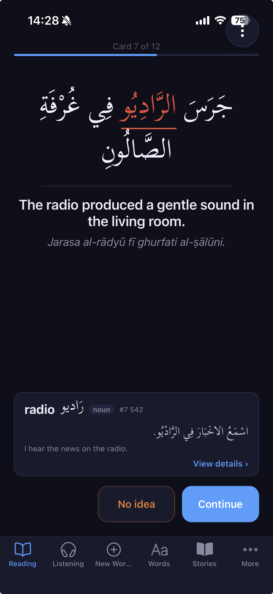
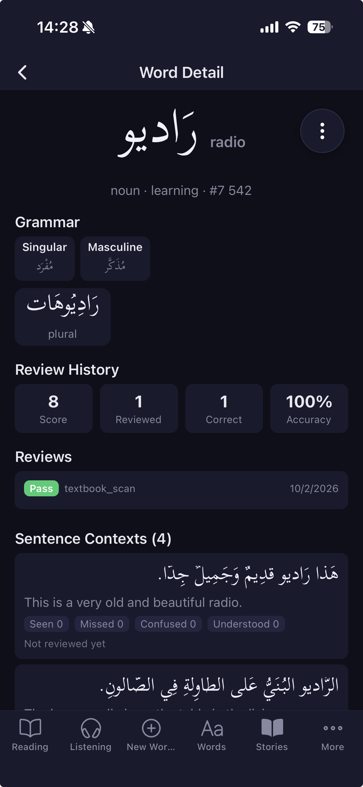

# Alif — Arabic Reading & Listening Trainer

A personal Arabic (MSA/fusha) learning app focused on reading and listening comprehension. Tracks word knowledge at root, lemma, and conjugation levels using FSRS spaced repetition. Uses LLM-generated sentences and stories tailored to your vocabulary.

> **This is a private project shared as-is.** It was built for one person's Arabic learning workflow using Claude Code. It is not a polished open-source product — there are hardcoded server addresses, personal deployment scripts, and opinionated design decisions throughout. It works well, but setting it up requires reading the code and adapting things to your own setup. Claude Code can help you with that.

<p align="center">
  
  
</p>

## What It Does

- **Sentence-first review**: Spaced repetition at the sentence level. A greedy set-cover algorithm picks sentences that maximize coverage of your due words. You tap words you missed or found confusing — every word in the sentence gets an FSRS review.
- **Reading mode**: See diacritized Arabic, tap words to look them up (with root-family predictions), then self-rate comprehension.
- **Listening mode**: Hear TTS audio first, then reveal text. Trains ear before eye.
- **Learn mode**: Introduces new words one at a time with forms tables, example sentences, root families, and a quiz.
- **Story mode**: Generate micro-fiction with your known vocabulary, or import any Arabic text. Tap-to-lookup reader with FSRS credit on completion.
- **Textbook scanner**: OCR Arabic pages, extract words, add them to your vocabulary.
- **Grammar tracking**: 24 grammar features across 5 tiers, with LLM-generated lessons.
- **Arabic NLP pipeline**: Clitic stripping, CAMeL Tools morphological analysis, root extraction, LLM-confirmed variant detection.

## Architecture

- **Backend**: Python / FastAPI / SQLite (single user, no auth)
- **Frontend**: Expo (React Native) — runs on iOS and web
- **SRS**: py-fsrs (FSRS algorithm)
- **LLM**: LiteLLM with automatic fallback (Gemini Flash → GPT → Claude Haiku)
- **TTS**: ElevenLabs REST API
- **NLP**: Rule-based clitic stripping + CAMeL Tools morphological analyzer (with graceful fallback if not installed)
- **Deployment**: Docker Compose, designed for a single cheap VPS

## Setting Up Your Own Instance

### Prerequisites

| Key | Service | Required? | Used for |
|-----|---------|-----------|----------|
| `GEMINI_KEY` | Google AI Studio | Recommended (primary LLM) | Sentence generation, grammar tagging, variant detection, OCR |
| `OPENAI_KEY` | OpenAI | Optional (fallback LLM) | LLM fallback, flag evaluation |
| `ANTHROPIC_API_KEY` | Anthropic | Optional (tertiary LLM) | LLM fallback |
| `ELEVENLABS_API_KEY` | ElevenLabs | Optional | Text-to-speech for listening mode |

You need at least one LLM key. Without `ELEVENLABS_API_KEY`, listening mode won't work but everything else will.

### Quick Start (Local)

```bash
# Backend
cd backend
cp .env.example .env    # fill in your API keys
pip install -e ".[dev]"
python scripts/import_duolingo.py   # seed 196 starter words
uvicorn app.main:app --port 8000

# Frontend (separate terminal)
cd frontend
npm install
npx expo start --web
```

### Quick Start (Docker)

```bash
cp backend/.env.example .env    # fill in your API keys
docker compose up -d --build
# Backend at http://localhost:3000
```

Then run the frontend separately (`cd frontend && npm install && npx expo start`).

### Connecting Frontend to Backend

The frontend reads its API URL from `frontend/app.json`:

```json
"extra": {
  "apiUrl": "http://localhost:3000"
}
```

Change this to point at wherever your backend is running. For bare python (no Docker) that's `http://localhost:8000`.

## Files You Need to Personalize

This codebase has hardcoded references to the original author's server, SSH alias, and domain. Here's what to update for your own setup:

| File | What's in it | What to do |
|------|-------------|------------|
| `frontend/app.json` | Backend API URL (IP address) | Point to your backend |
| `.env` | API keys | Fill in your own keys |
| `CLAUDE.md` | Server IP, SSH alias, DuckDNS domain, systemd service names | Update the Hosting/Deployment/Expo sections for your setup, or remove them if running locally |
| `.claude/skills/deploy.md` | Hardcoded deploy commands with server references | Rewrite for your server, or delete |
| `.claude/skills/backup.md` | SSH alias, container names | Update or delete |
| `.claude/skills/smoke-test.md` | Server IP in production section | Update or remove production commands |
| `scripts/deploy.sh` | SSH alias, DuckDNS domain | Update `SERVER` and `EXPO_URL` variables |
| `scripts/backup.sh` | SSH alias | Update `SERVER` variable |

If you're using Claude Code, you can just tell it "update all the deployment references to point at my server at X" and it will know what to do — `CLAUDE.md` documents the full architecture.

## Seeding Vocabulary

The app starts with an empty database. Import starter vocabulary with any of:

```bash
cd backend
python scripts/import_duolingo.py     # 196 words from Duolingo Arabic
python scripts/import_wiktionary.py   # larger set from Wiktionary
python scripts/import_avp_a1.py       # A1-level Arabic Vocabulary Project
```

You can also add words through the app itself: Learn mode introduces words one at a time, Story import analyzes pasted Arabic text, and the Textbook scanner OCRs photographed pages.

## Disabling CAMeL Tools

CAMeL Tools is an Arabic morphological analyzer that adds ~660MB to the Docker image. The app works without it — all morphology calls fall back to stubs gracefully. To disable:

1. Remove `camel-tools>=1.5.0` from `backend/pyproject.toml`
2. Remove the `camel_data` download line from `backend/Dockerfile`

You lose: lemmatization, root extraction, MLE disambiguation, variant detection. You keep: clitic stripping (rule-based), function word handling, FSRS scheduling, LLM generation, everything else.

## Tests

```bash
cd backend && python -m pytest    # ~559 tests, no API keys needed
```

## Adapting for Another Language

This is deeply Arabic-specific. The following would need replacement for another language:

- **Clitic stripping** (`sentence_validator.py`) — Arabic proclitics/enclitics
- **CAMeL Tools** (`morphology.py`) — Arabic-only morphological analyzer
- **Root system** (`roots` table) — Semitic tri-consonantal roots
- **Function words** — 60+ hardcoded Arabic function words
- **Diacritics/normalization** — tashkeel, hamza/alef normalization
- **RTL rendering** — throughout the frontend
- **TTS pauses** — inserts Arabic commas for learner-speed audio
- **LLM prompts** — all instruct "generate Arabic sentences"
- **Import scripts** — Arabic vocabulary sources

The FSRS scheduling, greedy set-cover session assembly, grammar tier system, story mode, and general UI architecture are language-agnostic in principle, but extracting them would be a significant project.
