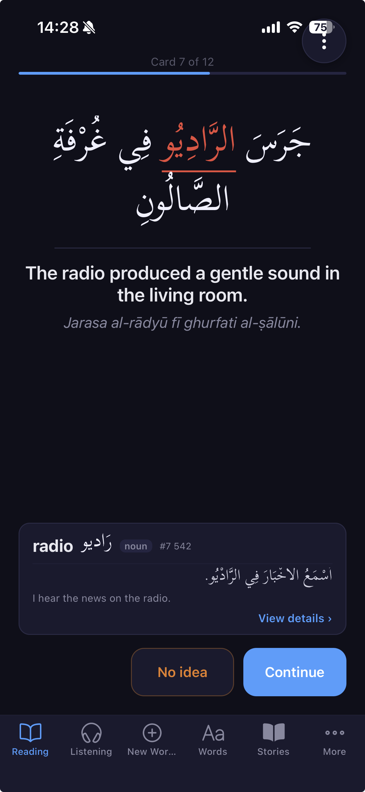
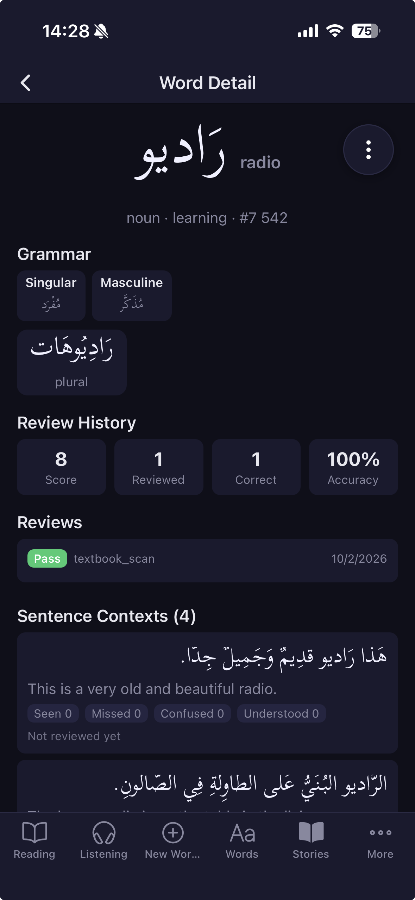

# Alif — Arabic Reading & Listening Trainer

A personal Arabic (MSA/fusha) learning app focused on reading and listening comprehension. Tracks word knowledge at root, lemma, and conjugation levels using FSRS spaced repetition. Uses LLM-generated sentences and stories tailored to your vocabulary.

> **This is a private project shared as-is.** It was built for one person's Arabic learning workflow using Claude Code. It is not a polished open-source product — there are hardcoded server addresses, personal deployment scripts, and opinionated design decisions throughout. It works well, but setting it up requires reading the code and adapting things to your own setup. Claude Code can help you with that.

<p align="center">
  
  
</p>

## What It Does

- **Sentence-first review**: Spaced repetition at the sentence level. A greedy set-cover algorithm picks sentences that maximize coverage of your due words. You tap words you missed or found confusing — every word in the sentence gets an FSRS review. Intro cards teach each new word before its first sentence appearance.
- **Reading mode**: See diacritized Arabic, tap words to look them up (with root-family predictions), then self-rate comprehension. Well-known words fade their diacritics (tashkeel fading), and cards alternate between two Arabic fonts (Scheherazade New + Amiri) to build familiarity with both learner-friendly and print-style typography.
- **Listening mode**: Hear TTS audio first, then reveal text. Story audio with voice rotation (3 ElevenLabs voices). Supports Professional Voice Clones.
- **Podcast generation**: Personalized audio episodes built from your FSRS vocabulary state. Six formats: sentence drill, story breakdown, comprehensible input, root explorer, word spotlight, story retelling. Segments stitched via pydub/ffmpeg with per-segment caching.
- **Learn mode**: Introduces new words with info-dense cards: forms tables, root/pattern chips, etymology, memory hooks, example sentences. Rescue cards re-teach stuck words (≥4 reviews, <50% accuracy).
- **Story mode**: Generate micro-fiction in 4 formats (standard, long, breakdown, arabic_explanation) with your known vocabulary, or import any Arabic text. Tap-to-lookup reader with FSRS credit on completion. Story audio with voice rotation, archive system, passive `times_heard` tracking. Auto-generate cron keeps ≥3 active stories.
- **Textbook scanner**: OCR Arabic pages via Gemini Vision, extract words, add them to your vocabulary. Batch processing with crash recovery.
- **Grammar tracking**: 49 grammar features across 8 tiers, with LLM-generated lessons.
- **Arabic NLP pipeline**: 7-stage sentence generation pipeline with 3-pass lemma lookup, clitic stripping, CAMeL Tools morphological analysis, root extraction, LLM mapping verification/correction, and LLM-confirmed variant detection with multi-hop chain resolution.

## Architecture

- **Backend**: Python / FastAPI / SQLite (single user, no auth, WAL mode)
- **Frontend**: Expo (React Native) — runs on iOS and web
- **SRS**: py-fsrs v6 (FSRS-6 with same-day review support)
- **LLM**: Two-tier strategy. Background/cron tasks use Claude CLI (free via Max plan): Sonnet for generation, Haiku for quality gate + verification. User-facing tasks use Gemini Flash (fast, ~1s). Fallback chain: Gemini Flash → GPT → Claude Haiku API.
- **TTS**: ElevenLabs REST API with Professional Voice Clone support. Voice pool (3 voices) for story audio rotation.
- **Audio**: pydub + ffmpeg for podcast segment stitching
- **NLP**: Rule-based clitic stripping + CAMeL Tools morphological analyzer (with graceful fallback if not installed)
- **Deployment**: Docker Compose, designed for a single cheap VPS

## Setting Up Your Own Instance

### Prerequisites

| Key | Service | Required? | Used for |
|-----|---------|-----------|----------|
| `GEMINI_KEY` | Google AI Studio | Recommended (primary LLM) | Sentence generation, grammar tagging, variant detection, OCR |
| `OPENAI_KEY` | OpenAI | Optional (fallback LLM) | LLM fallback, flag evaluation |
| `ANTHROPIC_API_KEY` | Anthropic | Optional (tertiary LLM) | LLM fallback |
| `ELEVENLABS_API_KEY` | ElevenLabs | Optional | TTS for listening mode, story audio, and podcasts |

You need at least one LLM key. Without `ELEVENLABS_API_KEY`, listening mode, story audio, and podcast generation won't work but everything else will.

### Quick Start (Local)

```bash
# Backend
cd backend
cp .env.example .env    # fill in your API keys
pip install -e ".[dev]"
python scripts/import_duolingo.py   # seed 196 starter words
uvicorn app.main:app --port 8000

# Frontend (separate terminal)
cd frontend
npm install
npx expo start --web
```

### Quick Start

```bash
cp backend/.env.example backend/.env    # fill in your API keys
cd backend
python3 -m venv .venv
.venv/bin/pip install -e .
.venv/bin/uvicorn app.main:app --port 8000
# Backend at http://localhost:8000
```

Then run the frontend separately (`cd frontend && npm install && npx expo start`).

### Connecting Frontend to Backend

The frontend reads its API URL from `frontend/app.json`:

```json
"extra": {
  "apiUrl": "http://localhost:8000"
}
```

Change this to point at wherever your backend is running.

## Deploying to a VPS (Hetzner, etc.)

The app is designed to run on a single cheap VPS. Here's how to set it up from scratch.

### 1. Provision a server

Any Linux VPS works. A Hetzner CX22 (~€4/mo, 2 vCPU, 4GB RAM) is plenty. Pick Ubuntu 24.04.

Set up SSH key access:
```bash
# On your local machine
ssh-keygen -t ed25519 -f ~/.ssh/myserver
ssh-copy-id -i ~/.ssh/myserver root@YOUR_SERVER_IP

# Add an alias to ~/.ssh/config
Host alif
    HostName YOUR_SERVER_IP
    User root
    IdentityFile ~/.ssh/myserver
```

### 2. Install dependencies on the server

```bash
ssh alif

# Python + Node.js (for the Expo dev server)
apt-get update
apt-get install -y python3 python3-venv git
curl -fsSL https://deb.nodesource.com/setup_22.x | bash -
apt-get install -y nodejs
```

### 3. Clone and configure

```bash
cd /opt
git clone https://github.com/YOUR_USER/alif.git
cd alif

# Create backend/.env with your API keys
cat > backend/.env << 'EOF'
GEMINI_KEY=your-gemini-key
OPENAI_KEY=your-openai-key
ANTHROPIC_API_KEY=your-anthropic-key
ELEVENLABS_API_KEY=your-elevenlabs-key
EOF
```

### 4. Start the backend

```bash
cd /opt/alif/backend
python3 -m venv .venv
.venv/bin/pip install -e .

# Create systemd service
cat > /etc/systemd/system/alif-backend.service << 'EOF'
[Unit]
Description=Alif Backend API
After=network.target

[Service]
Type=simple
WorkingDirectory=/opt/alif/backend
ExecStart=/opt/alif/backend/.venv/bin/uvicorn app.main:app --host 0.0.0.0 --port 3000
Restart=always
RestartSec=5
EnvironmentFile=/opt/alif/backend/.env

[Install]
WantedBy=multi-user.target
EOF

systemctl daemon-reload
systemctl enable --now alif-backend
# Verify: curl http://localhost:3000/api/stats
```

The backend runs as a plain systemd service reading from `/opt/alif/backend/.venv`. The SQLite database lives at `/opt/alif/backend/data/alif.db`.

### 5. Seed starter vocabulary

```bash
cd /opt/alif/backend && .venv/bin/python scripts/import_duolingo.py
```

### 6. Start the frontend (Expo dev server)

The frontend runs as a systemd service outside Docker:

```bash
# Install frontend dependencies
cd /opt/alif/frontend
npm install

# Create systemd service
cat > /etc/systemd/system/alif-expo.service << EOF
[Unit]
Description=Alif Expo Dev Server
After=network.target

[Service]
Type=simple
WorkingDirectory=/opt/alif/frontend
Environment=REACT_NATIVE_PACKAGER_HOSTNAME=YOUR_DOMAIN_OR_IP
ExecStart=/usr/bin/npx expo start --web --port 8081
Restart=always
RestartSec=5

[Install]
WantedBy=multi-user.target
EOF

systemctl daemon-reload
systemctl enable --now alif-expo
```

Replace `YOUR_DOMAIN_OR_IP` with your server's IP or domain name. This is what the Expo app uses to connect from your phone.

### 7. Point the frontend at your backend

Edit `frontend/app.json` and set the API URL:
```json
"extra": {
  "apiUrl": "http://YOUR_SERVER_IP:3000"
}
```

Then restart Expo: `systemctl restart alif-expo`

### 8. (Optional) Set up a domain with DuckDNS

[DuckDNS](https://www.duckdns.org/) gives you a free subdomain that points at your server IP:

```bash
# One-time setup
curl "https://www.duckdns.org/update?domains=YOURNAME&token=YOUR_TOKEN&ip=YOUR_SERVER_IP"
```

Then use `YOURNAME.duckdns.org` as your `REACT_NATIVE_PACKAGER_HOSTNAME` and in `app.json`.

### 9. (Optional) Set up backups

The repo includes a backup script that copies the SQLite DB to your local machine with grandfather-father-son retention:

```bash
# On your local machine — edit scripts/backup.sh and set SERVER=alif
# Then add a daily cron job:
crontab -e
# Add: 0 9 * * * /path/to/alif/scripts/backup.sh
```

For server-side backups, add a cron job on the server:
```bash
crontab -e
# Add: 0 */6 * * * sqlite3 /opt/alif/backend/data/alif.db 'PRAGMA wal_checkpoint(TRUNCATE);' && cp /opt/alif/backend/data/alif.db /opt/alif-backups/alif_$(date +\%Y\%m\%d_\%H\%M).db
```

### 10. Deploy updates

After pushing changes to your repo:

```bash
# Backend only
ssh alif "cd /opt/alif && git pull && cd backend && .venv/bin/pip install -e . --quiet && systemctl restart alif-backend"

# Frontend only
ssh alif "cd /opt/alif && git pull && cd frontend && npm install && systemctl restart alif-expo"

# Both
ssh alif "cd /opt/alif && git pull && cd backend && .venv/bin/pip install -e . --quiet && systemctl restart alif-backend && cd ../frontend && npm install && systemctl restart alif-expo"
```

Or use the included deploy script: `scripts/deploy.sh` (update the `SERVER` and `EXPO_URL` variables first).

### Connecting from your phone

Open the Expo Go app and enter: `exp://YOUR_DOMAIN_OR_IP:8081`

### Using Claude Code for deployment

If you're using Claude Code, update the references in `CLAUDE.md` and `.claude/skills/` to point at your server, and Claude will handle deploys for you. Tell it something like "update all deployment references to my server at 1.2.3.4 with domain foo.duckdns.org" and it will find and update everything.

## Files You Need to Personalize

This codebase has hardcoded references to the original author's server, SSH alias, and domain. Here's what to update for your own setup:

| File | What's in it | What to do |
|------|-------------|------------|
| `frontend/app.json` | Backend API URL (IP address) | Point to your backend |
| `.env` | API keys | Fill in your own keys |
| `CLAUDE.md` | Server IP, SSH alias, DuckDNS domain, systemd service names | Update the Hosting/Deployment/Expo sections for your setup, or remove them if running locally |
| `.claude/skills/deploy.md` | Hardcoded deploy commands with server references | Rewrite for your server, or delete |
| `.claude/skills/backup.md` | SSH alias, container names | Update or delete |
| `.claude/skills/smoke-test.md` | Server IP in production section | Update or remove production commands |
| `scripts/deploy.sh` | SSH alias, DuckDNS domain | Update `SERVER` and `EXPO_URL` variables |
| `scripts/backup.sh` | SSH alias | Update `SERVER` variable |

If you're using Claude Code, you can just tell it "update all the deployment references to point at my server at X" and it will know what to do — `CLAUDE.md` documents the full architecture.

## Seeding Vocabulary

The app starts with an empty database. Import starter vocabulary with any of:

```bash
cd backend
python scripts/import_duolingo.py     # 196 words from Duolingo Arabic
python scripts/import_wiktionary.py   # larger set from Wiktionary
python scripts/import_avp_a1.py       # A1-level Arabic Vocabulary Project
```

You can also add words through the app itself: Learn mode introduces words one at a time, Story import analyzes pasted Arabic text, and the Textbook scanner OCRs photographed pages.

## Disabling CAMeL Tools

CAMeL Tools is an Arabic morphological analyzer that adds ~660MB of data files. The app works without it — all morphology calls fall back to stubs gracefully. To disable:

1. Remove `camel-tools>=1.5.0` from `backend/pyproject.toml`
2. Skip the `camel_data` download during install

You lose: lemmatization, root extraction, MLE disambiguation, variant detection. You keep: clitic stripping (rule-based), function word handling, FSRS scheduling, LLM generation, everything else.

## Tests

```bash
cd backend && python -m pytest    # ~833 tests, no API keys needed
```

## Adapting for Another Language

This is deeply Arabic-specific. The following would need replacement for another language:

- **Clitic stripping** (`sentence_validator.py`) — Arabic proclitics/enclitics
- **CAMeL Tools** (`morphology.py`) — Arabic-only morphological analyzer
- **Root system** (`roots` table) — Semitic tri-consonantal roots
- **Function words** — 60+ hardcoded Arabic function words
- **Diacritics/normalization** — tashkeel, hamza/alef normalization
- **RTL rendering** — throughout the frontend
- **TTS pauses** — inserts Arabic commas for learner-speed audio
- **LLM prompts** — all instruct "generate Arabic sentences"
- **Import scripts** — Arabic vocabulary sources

The FSRS scheduling, greedy set-cover session assembly, grammar tier system, story mode, and general UI architecture are language-agnostic in principle, but extracting them would be a significant project.
